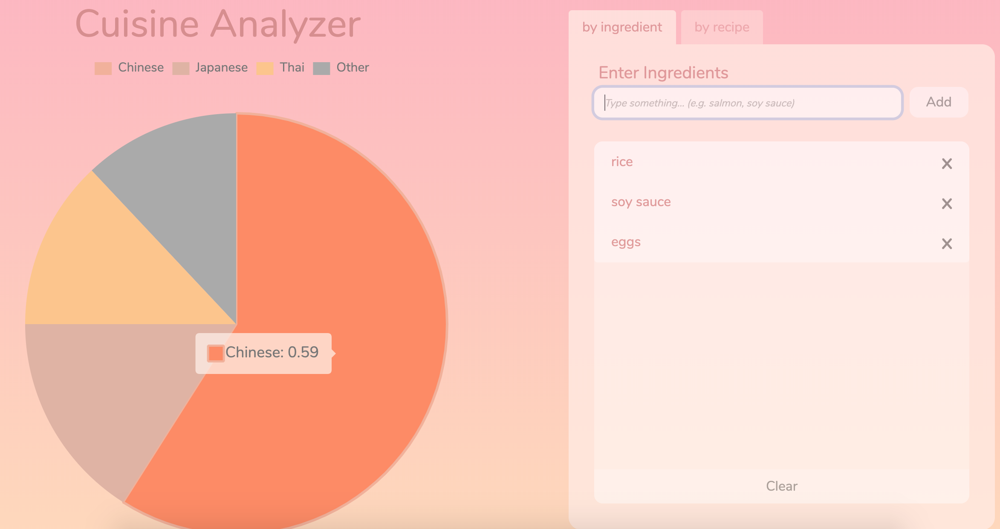
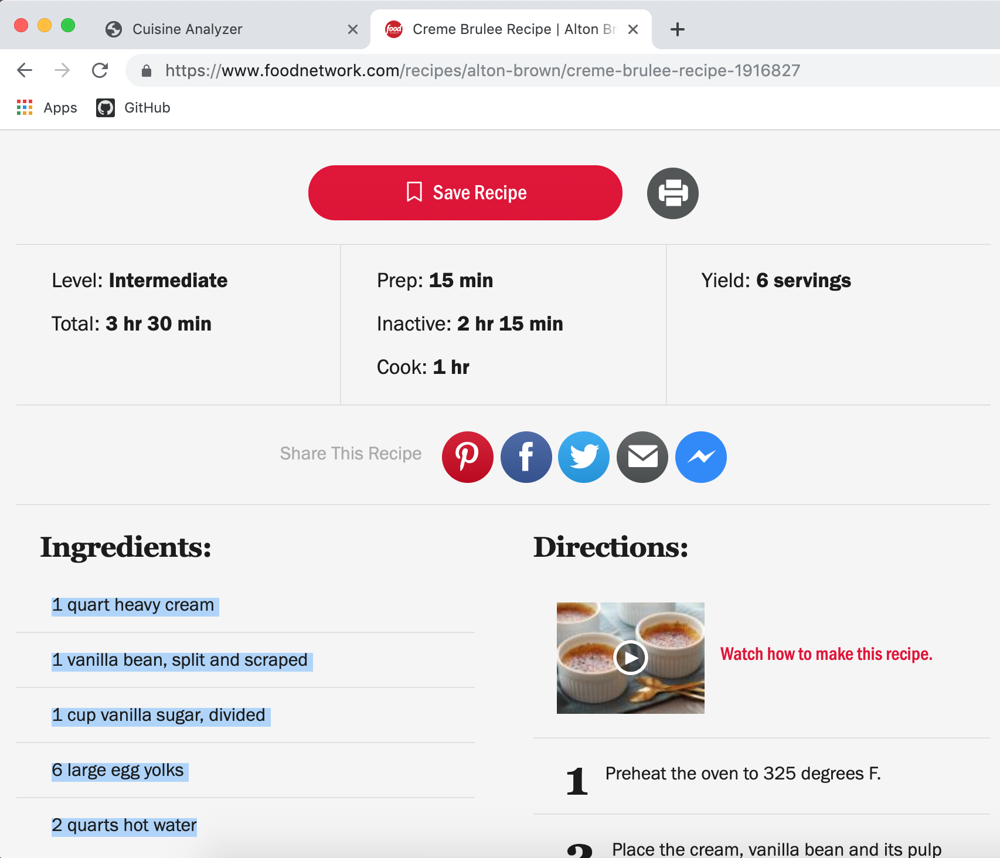
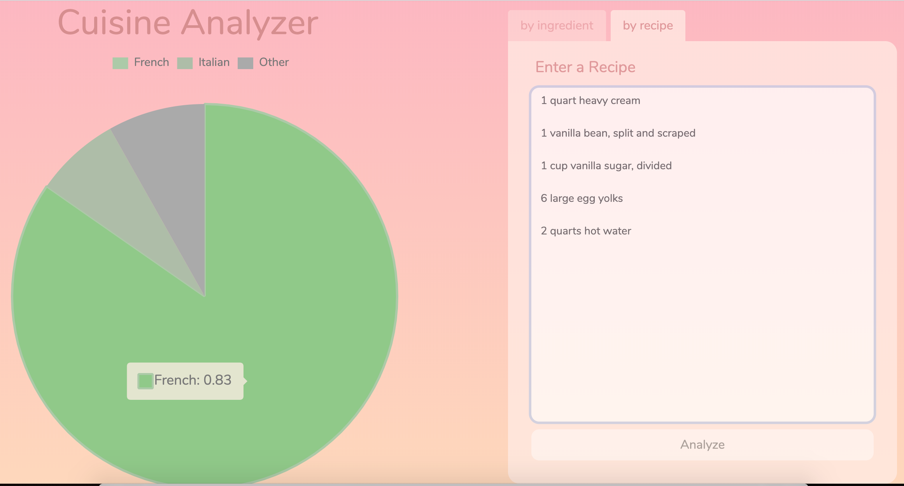
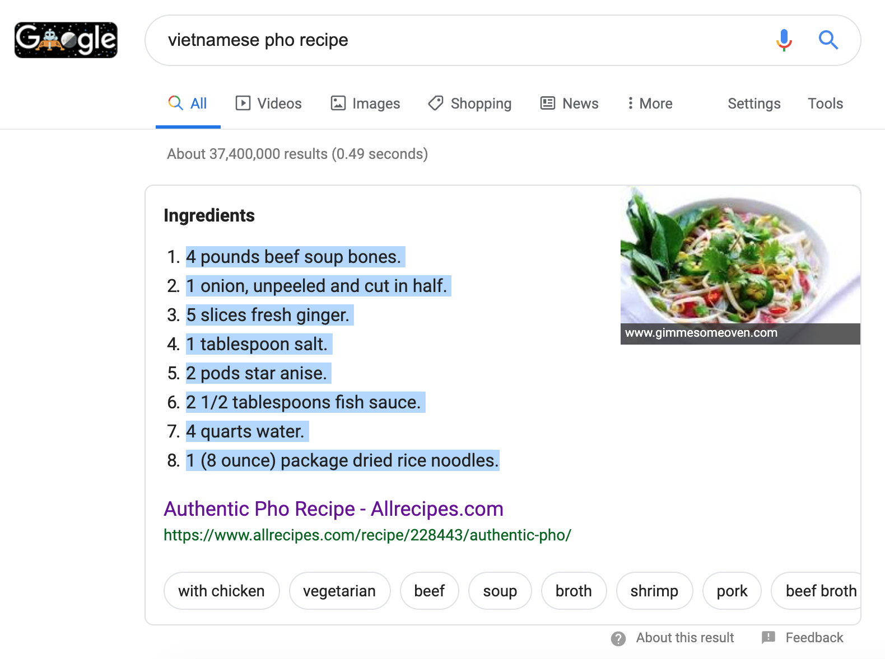
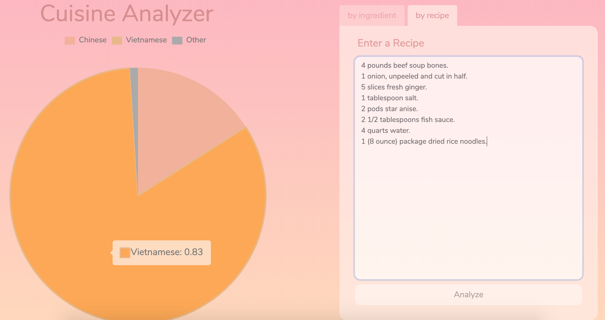

# CuisineClassifier
Open source project to classify cuisines based on ingredients for CS 4701: AI Practicum by
Brian Cheang, Alvin Qu, and David Jin. For a more detailed description of the project, please see
the FinalReport.pdf

## Summary
A large part of a culture’s makeup is its cuisine. Throughout history, different recipes have been
spread via trade, word of mouth, or through generational migration. The world’s most popular dishes
differ in their flavor profiles largely due to their ingredients. Regional disparities in crops,
livestock, and spices have shaped today’s diverse portfolio of flavor profiles. At the same time,
however, globalization and trade have intertwined many of our cultures, resulting in an overlap in
ingredients used in different cuisines. For example, East Asian trade led to similarities between
Chinese, Japanese, Korean, and Tibetan cuisine. A Chinese classic, ​mantou​ (steamed, sweetened
  bun), appears in Japan as ​manzu​, in Korea as ​mandu​, and in Tibet as ​momo.​

As a result, the motivation behind our project was to be able to attempt to understand cultural
differences and similarities by quantifying their respective cuisine disparities through
ingredients. Although this project initially started as a non-probabilistic classification, where
we wanted to predict the cuisine given a set of ingredients, we eventually transitioned and wanted
to answer the bigger question of the relationships between ingredients and cuisines by being able
to predict a percentage match between a set of ingredients to cuisines. Instead of asking the
question: “What is typically in a Cajun dish? What about a Japanese recipe?”, we instead posed the
more interesting contrary: “If I have eggs and soy sauce, what cuisines would I be more likely to
make?”

The following images are examples of how we played around with our project.

You can first enter in ingredients one by one, and the circle dynamically updates:

Or, you can copy paste an entire recipe from Google. We searched up a creme brulee recipe on Google.

The results:

Another example, this time with Pho:

The results:

## Installation
Navigate to the backend folder and run "python server.py" in the command line, which will start
a local server, then navigate to http://localhost:5000/ on any web browser.

Have fun!
